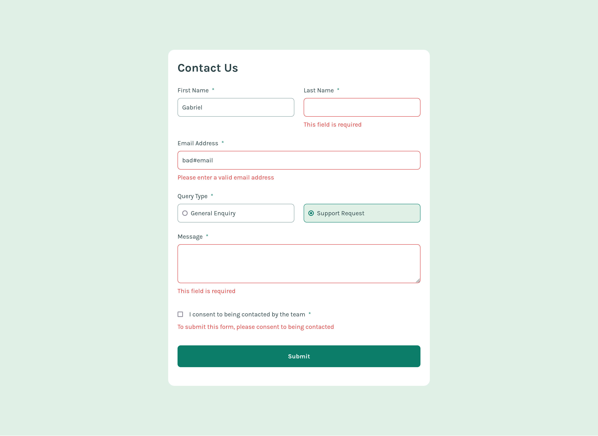

# Frontend Mentor - Contact form solution

This is a solution to the [Contact form challenge on Frontend Mentor](https://www.frontendmentor.io/challenges/contact-form--G-hYlqKJj). Frontend Mentor challenges help you improve your coding skills by building realistic projects.

## Table of contents

- [Overview](#overview)
  - [The challenge](#the-challenge)
  - [Screenshot](#screenshot)
  - [Links](#links)
- [My process](#my-process)
  - [Built with](#built-with)
  - [What I learned](#what-i-learned)
- [Author](#author)

## Overview

### The challenge

Users should be able to:

- Complete the form and see a success toast message upon successful submission
- Receive form validation messages if:
  - A required field has been missed
  - The email address is not formatted correctly
- Complete the form only using their keyboard
- Have inputs, error messages, and the success message announced on their screen reader
- View the optimal layout for the interface depending on their device's screen size
- See hover and focus states for all interactive elements on the page

### Screenshot

### Links

- Solution URL: [GitHub Repository](https://github.com/gabriel-de-azevedo/contact-form)
- Live Site URL: [GitHub Page](https://gabriel-de-azevedo.github.io/contact-form/)

## My process

### Built with

- Semantic HTML5 markup
- CSS custom properties
- Flexbox
- CSS Grid
- Mobile-first workflow
- [React](https://react.dev/)
- [Tailwind CSS](https://tailwindcss.com/)
- [React Hook Form](https://www.react-hook-form.com/)
- [React Toastify](https://www.npmjs.com/package/react-toastify)

### What I learned

## Author

- GitHub - [gabriel-de-azevedo](https://github.com/gabriel-de-azevedo)
- LinkedIn - [gabriel-marques-de-azevedo](https://www.linkedin.com/in/gabriel-marques-de-azevedo/)
- Frontend Mentor - [@gabriel-de-azevedo](https://www.frontendmentor.io/profile/gabriel-de-azevedo)
